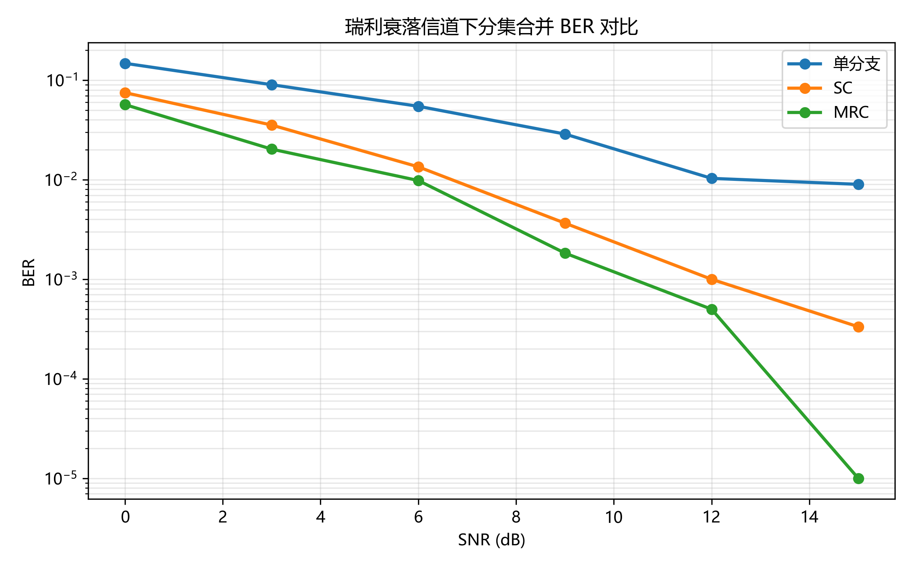
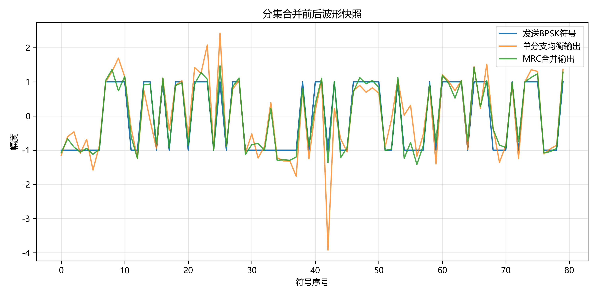
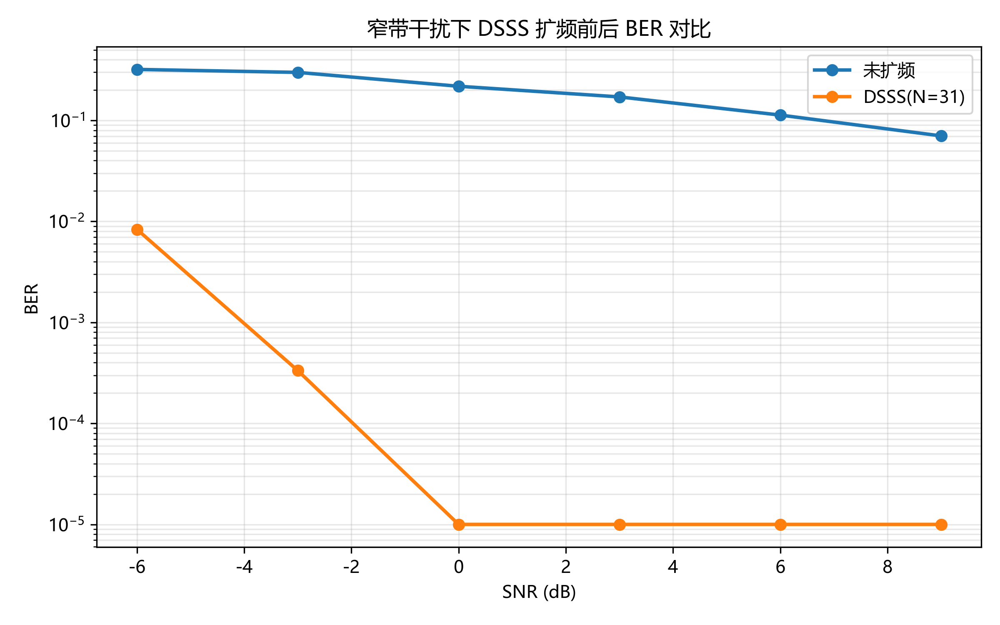
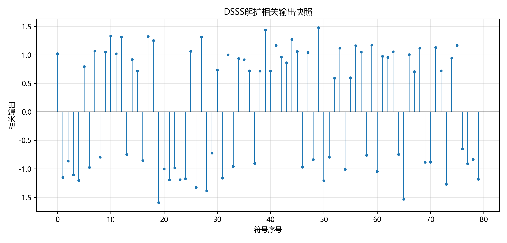

# 无线通信技术实验报告：分集与扩频通信

## 1. 实验目的

说明本实验希望掌握的分集合并、直接序列扩频和 GitHub 自动评分技能。

## 2. 实验原理

### 2.1 分集合并

说明瑞利衰落、深衰落、选择合并 SC、最大比合并 MRC 和分集增益。

### 2.2 扩频通信

说明 DSSS、m 序列、扩频、相关解扩、处理增益和窄带干扰抑制。

## 3. 实验环境

- Python 版本：
- 主要依赖：NumPy、Matplotlib、pytest
- AI 助手使用情况：

## 4. 实验方法与步骤

### 4.1 Part 1：分集合并

描述 BPSK、瑞利衰落、多分支接收、SC/MRC 合并、BER 统计流程。

### 4.2 Part 2：DSSS 扩频通信

描述 m 序列生成、扩频、加噪声/干扰、解扩、BER 对比流程。

## 5. 实验结果

插入结果图：

```markdown




```

## 6. 结果分析与讨论

回答：

1. 为什么瑞利衰落会造成深衰落？
2. SC 和 MRC 的合并思想有什么不同？
3. 为什么 MRC 通常优于 SC？
4. DSSS 的处理增益如何由扩频因子决定？
5. 窄带干扰经过解扩后为什么会被摊薄？
6. 本实验中 BER 曲线是否符合理论预期？

## 7. 实验心得

说明你对分集、扩频、自动评分和 AI 编程辅助的理解。

## 8. 参考资料

- 课程课件：第8章 分集
- 课程课件：第9章 扩展频谱通信
